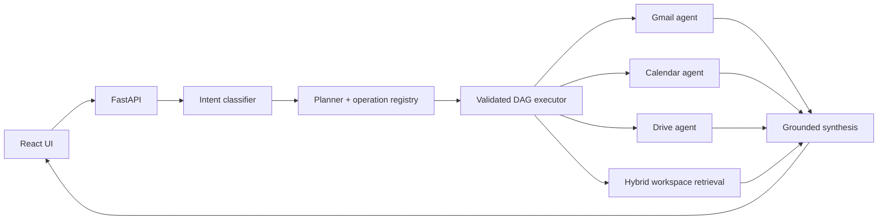

# Agentic Google Workspace Orchestrator

A full-stack workspace assistant that turns natural-language requests into coordinated Gmail, Google Calendar, and Google Drive workflows. It combines Groq-based structured planning, a custom dependency-aware DAG executor, approval-gated writes, and user-scoped hybrid retrieval over a locally synchronized pgvector index.

## Demo

The demo interface is a React/TypeScript chat application with sync status, service indicators, execution details, clarification turns, and explicit approval cards.

**Demo video:** `<ADD VIDEO LINK>`

Screenshot placeholders and capture guidance are in [docs/screenshots/README.md](docs/screenshots/README.md).

## Key features

- Natural-language Gmail, Calendar, and Drive reads through native Google APIs.
- Structured Groq intent classification, planning, and grounded synthesis.
- Custom DAG execution with concurrent independent steps and prior-result references.
- Cross-service contextual retrieval using local MiniLM embeddings, PostgreSQL text relevance, and pgvector.
- Persisted conversation context, execution plans, step results, approvals, and audit events.
- Deterministic operation validation and explicit approval before external writes.
- Calendar invitations, timezone-aware scheduling, and optional real Google Meet creation.
- Encrypted Google credentials, HttpOnly sessions, and user-scoped storage/retrieval.
- Bounded Celery synchronization, per-service freshness, Redis overlap locks, and native read fallback.
- React UI with sync controls, service badges, partial-failure warnings, and safe links.

## Architecture



PostgreSQL/pgvector persists application and retrieval data, Redis supports sessions/cache/coordination, and Celery Worker + Beat maintain the local index. See [docs/architecture.md](docs/architecture.md) and [DESIGN.md](DESIGN.md).

## Tech stack

- **Backend:** Python 3.11+, FastAPI, Pydantic v2, SQLAlchemy, Alembic, Psycopg 3
- **Data and jobs:** PostgreSQL 16, pgvector, Redis 7, Celery Worker and Beat
- **AI and retrieval:** Groq OpenAI-compatible API, `sentence-transformers/all-MiniLM-L6-v2`
- **Google:** OAuth 2.0, Gmail API, Calendar API, Drive API
- **Frontend:** React, TypeScript, Vite, custom CSS
- **Runtime:** Docker Compose

## How it works

1. Google OAuth stores encrypted credentials and creates an HttpOnly application session.
2. The query API loads recent conversation context and classifies the request into a typed intent.
3. The planner uses registered operation specifications to build a validated execution DAG.
4. The executor runs independent nodes concurrently and resolves explicit references for dependent nodes.
5. Native agents or the user-scoped hybrid index retrieve evidence. Consequential steps stop at an approval boundary.
6. Compact structured results are synthesized into a grounded response; failures and successful empty results remain distinct.

## Safe writes

Calendar, Gmail, and Drive writes covered by the registry's write policy are stored as fully resolved proposed actions. The UI shows a sanitized preview and requires **Approve** or **Reject**. Approval executes exactly the stored action without replanning; an already processed approval returns HTTP 409 and cannot run twice. Nothing is automatically approved.

## Retrieval and synchronization

Celery Beat queues connected users approximately every 15 minutes. Workers normalize bounded Gmail, Calendar, and Drive resources, create 384-dimensional local embeddings, and store chunks in pgvector. Hybrid search combines 75% cosine similarity and 25% PostgreSQL text relevance, then applies metadata/service filters, relevance thresholds, deduplication, and `top_k` bounds.

Google remains authoritative. The local index is eventually consistent and supplements native APIs for semantic context. Freshness is calculated per service; fallback metadata distinguishes a recommendation from a native fallback that actually executed. PDFs are searchable by filename/metadata only; PDF body OCR is not implemented.

## Quick start

### 1. Clone and configure

```bash
git clone https://github.com/SidharthaIITKGP/agentic-google-workspace-orchestrator.git
cd agentic-google-workspace-orchestrator
cp .env.example .env
```

Set real local values in `.env` for `GOOGLE_CLIENT_ID`, `GOOGLE_CLIENT_SECRET`, `TOKEN_ENCRYPTION_KEY`, and `GROQ_API_KEY`. Keep `GOOGLE_REDIRECT_URI=http://localhost:8000/api/v1/auth/google/callback` for this local setup.

Generate a Fernet key locally:

```bash
python -c "from cryptography.fernet import Fernet; print(Fernet.generate_key().decode())"
```

In Google Cloud, enable Gmail, Calendar, and Drive APIs and register the exact redirect URI above.

### 2. Build infrastructure and migrate

```bash
docker compose build
docker compose up -d db redis
docker compose run --rm api python -m alembic upgrade head
```

### 3. Start the application

```bash
docker compose up -d
docker compose ps
```

Open:

- UI: `http://localhost:5173`
- Google login: `http://localhost:8000/api/v1/auth/google`
- Swagger UI: `http://localhost:8000/docs`
- Liveness: `http://localhost:8000/health`
- Readiness: `http://localhost:8000/ready`

Authenticate in the same browser before using the UI. For normal shutdown, preserve PostgreSQL data:

```bash
docker compose down
```

Do not use `docker compose down -v` for routine shutdown; it deletes the persistent `postgres_data` volume.

## Environment variables

Principal local settings are documented with safe placeholders in [.env.example](.env.example); additional bounded TTL/timeout settings have safe defaults in `app/core/config.py`.

| Group | Variables |
|---|---|
| Application | `APP_NAME`, `APP_ENV`, `LOG_LEVEL`, `FRONTEND_ORIGIN` |
| PostgreSQL | `POSTGRES_DB`, `POSTGRES_USER`, `POSTGRES_PASSWORD`, `DATABASE_URL`, pool settings |
| Redis | `REDIS_URL`, `REDIS_KEY_NAMESPACE`, `DEPENDENCY_TIMEOUT_SECONDS` |
| Google OAuth | `GOOGLE_CLIENT_ID`, `GOOGLE_CLIENT_SECRET`, `GOOGLE_REDIRECT_URI` |
| Security/LLM | `TOKEN_ENCRYPTION_KEY`, `GROQ_API_KEY`, `GROQ_MODEL` |
| Time handling | `DEFAULT_USER_TIMEZONE`, `DEFAULT_MEETING_DURATION_MINUTES` |
| Retrieval | `EMBEDDING_MODEL`, `EMBEDDING_DIMENSIONS`, cache/warmup/staleness settings |
| Sync | Gmail/Drive bounds, Calendar window, and sync-lock TTL settings |

Never commit `.env`, `frontend/.env`, tokens, cookies, or real credentials.

## Example queries

See [docs/SAMPLE_QUERIES.md](docs/SAMPLE_QUERIES.md) for Gmail, Calendar, Drive, multi-service, clarification, conversation, and approval-gated examples.

## API

See [API.md](API.md), Swagger at `http://localhost:8000/docs`, and the credential-free [Postman collection](docs/Agentic_Workspace_Orchestrator.postman_collection.json).

Export the exact running OpenAPI document with:

```bash
curl --fail http://localhost:8000/openapi.json -o docs/openapi.json
```

## Database

See [docs/ER_DIAGRAM.md](docs/ER_DIAGRAM.md). Migrations are explicit and are not run at application startup:

```bash
docker compose exec api python -m alembic current
docker compose exec api python -m alembic upgrade head
docker compose exec api python -m alembic check
```

## Evaluation

See [docs/EVALUATION.md](docs/EVALUATION.md). Checked-in retrieval metrics have not been recorded yet; do not infer performance from design targets.

```bash
docker compose exec api python -m app.retrieval.evaluate
```

## Testing

Backend tests:

```bash
source .venv/bin/activate
python -m pytest -q
```

Frontend tests and production build:

```bash
cd frontend
npm ci
npm test -- --run
npm run build
```

Live infrastructure checks:

```bash
docker compose exec api python -m app.db.check_connectivity
curl --fail http://localhost:8000/health
curl --fail http://localhost:8000/ready
```

## Demo script

Use [docs/DEMO_SCRIPT.md](docs/DEMO_SCRIPT.md) and complete [docs/SUBMISSION_CHECKLIST.md](docs/SUBMISSION_CHECKLIST.md) before submission.

## Security

- Google credentials are encrypted at rest; browser JavaScript receives only an HttpOnly application session.
- OAuth state is short-lived and one-time; production cookies are `Secure` and SameSite=Lax.
- Conversations, executions, approvals, sync state, caches, and retrieval queries are user scoped.
- LLM-generated plans are constrained by schemas, operation specifications, deterministic validation, and approval policy.
- The frontend renders workspace content as text rather than trusted HTML.

## Limitations

- Google OAuth may remain in testing mode depending on the Cloud project and test-user list.
- The index is eventually consistent and its 15-minute target depends on Celery and Google quotas.
- Local CPU embeddings can have a noticeable cold-start cost; warmup is optional.
- PDF bodies are not extracted or OCR'd.
- One configurable default timezone is used rather than a stored per-user preference.
- The UI is optimized for a laptop demonstration, not comprehensive account administration.
- Evaluation fixtures are small and synthetic; checked-in production-quality metrics are unavailable.

## Repository structure

```text
app/
  agents/          Gmail, Calendar, Drive, and workspace agents
  api/routes/      health, auth, query, approval, and sync routes
  auth/            credential encryption and security
  db/              SQLAlchemy models and async sessions
  integrations/    authenticated Google client factory
  llm/             Groq provider
  orchestration/   classifier, planner, registry, DAG executor, synthesis
  retrieval/       normalization, embeddings, indexing, search, evaluator
  sync/            per-service synchronization
  workers/         Celery application and tasks
frontend/          React + TypeScript + Vite UI
alembic/           database migrations
docs/              architecture, ER, evaluation, examples, demo artifacts
tests/             backend test suite
```

## Experimental branch

The optional [`experiment/jev-hybrid`](https://github.com/SidharthaIITKGP/agentic-google-workspace-orchestrator/tree/experiment/jev-hybrid) branch explores a specialized local bounded-decision model for routing and reranking while retaining Groq for planning and synthesis. It is not part of the stable `main` solution, and no latency or accuracy improvement is claimed without reproducible benchmark evidence.
