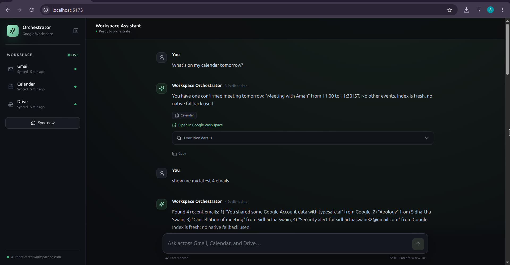
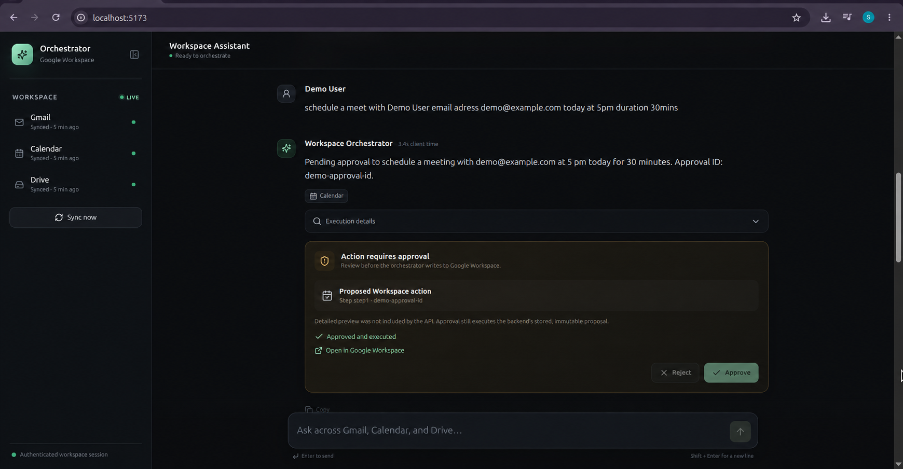
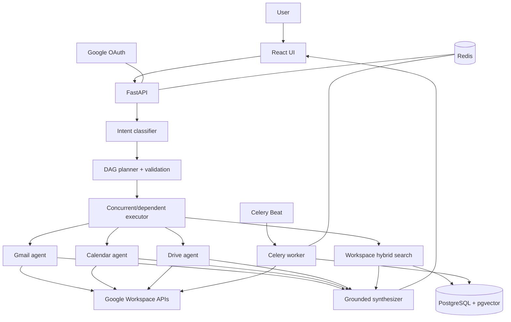

# Agentic Google Workspace Orchestrator

A full-stack AI workspace assistant that converts natural-language goals into coordinated Gmail, Google Calendar, and Google Drive workflows. Each request moves through structured intent classification, dependency-aware DAG planning, parallel or sequential tool execution, and grounded response synthesis. Consequential writes always pause for explicit human approval.

```text
Natural-language request → Intent → DAG plan → Tool execution
                         → Gmail / Calendar / Drive / pgvector retrieval
                         → Grounded response
```

## What it does

- Orchestrates Gmail, Calendar, and Drive from natural-language requests.
- Executes a custom dependency-aware DAG with parallel independent calls.
- Resolves prior-step outputs for contextual multi-service workflows.
- Retrieves cross-service context with PostgreSQL, pgvector, and local embeddings.
- Persists conversations, executions, results, approvals, and audit events.
- Requires explicit approval before external writes.
- Synchronizes user-scoped workspace data with Celery Worker and Beat.

## Demo

**Demo video:** [Watch the five-minute project demo](https://drive.google.com/file/d/1PTiq5G_dacF8oWr0AbhzpM_Jevh74njn/view?usp=sharing)

### Multi-service orchestration



### Approval-gated write



Screenshot capture and sanitization guidance is available in [docs/screenshots/README.md](docs/screenshots/README.md).

## Architecture



Google APIs remain authoritative. The local semantic index supplements native search for contextual retrieval and is maintained by bounded background synchronization. Detailed design is documented in [DESIGN.md](DESIGN.md) and [docs/architecture.md](docs/architecture.md).

## Why this is agentic

This is not a single prompt-to-response LLM call. The system interprets a goal, selects registered services and operations, constructs a validated dependency graph, executes independent work concurrently, and propagates real tool results into dependent steps. It can pause at a human-approval boundary before side effects, then synthesizes only the evidence produced by executed tools.

## End-to-end example

**User:** “Prepare me for my next meeting and find related emails and files.”

```text
Calendar: locate the next meeting
                ↓
Extract title, time, attendees, and useful topic context
                ↓
Gmail semantic search ─┐
                       ├─ run in parallel
Drive semantic search ─┘
                ↓
Grounded preparation summary
```

See [docs/SAMPLE_QUERIES.md](docs/SAMPLE_QUERIES.md) for Gmail, Calendar, Drive, conversation, clarification, multi-service, and write examples.

## Safe writes

```text
User request
    ↓
Validated, fully resolved proposed action is stored
    ↓
PENDING APPROVAL
    ↓
Approve ─────────────── Reject
    ↓                     ↓
Execute stored action    No Google API write
```

Approval executes exactly the stored action without replanning. A processed approval cannot execute twice, and LLM output cannot authorize a side effect. The UI shows a sanitized preview before the user chooses **Approve** or **Reject**.

## Tech stack

| Layer | Technologies |
|---|---|
| Backend | Python, FastAPI, Pydantic, SQLAlchemy, Alembic |
| Data and jobs | PostgreSQL, pgvector, Redis, Celery |
| AI and retrieval | Groq, `sentence-transformers/all-MiniLM-L6-v2` |
| Google | Gmail API, Calendar API, Drive API, OAuth 2.0 |
| Frontend | React, TypeScript, Vite |
| Infrastructure | Docker Compose |

## Quick start

### 1. Clone and configure

```bash
git clone https://github.com/SidharthaIITKGP/agentic-google-workspace-orchestrator.git
cd agentic-google-workspace-orchestrator
cp .env.example .env
```

Set `GOOGLE_CLIENT_ID`, `GOOGLE_CLIENT_SECRET`, `TOKEN_ENCRYPTION_KEY`, and `GROQ_API_KEY` in `.env`. For local development, register this exact Google OAuth redirect URI:

```text
http://localhost:8000/api/v1/auth/google/callback
```

Generate a Fernet encryption key if needed:

```bash
python -c "from cryptography.fernet import Fernet; print(Fernet.generate_key().decode())"
```

### 2. Build, migrate, and start

```bash
docker compose build
docker compose up -d db redis
docker compose run --rm api python -m alembic upgrade head
docker compose up -d
docker compose ps
```

### 3. Open the application

- React UI: `http://localhost:5173`
- Google OAuth: `http://localhost:8000/api/v1/auth/google`
- Swagger UI: `http://localhost:8000/docs`
- OpenAPI JSON: `http://localhost:8000/openapi.json`
- Liveness: `http://localhost:8000/health`
- Readiness: `http://localhost:8000/ready`

Authenticate in the same browser before using the UI. Use `docker compose down` for routine shutdown; `docker compose down -v` also deletes persistent PostgreSQL data.

## Documentation

| Document | Purpose |
|---|---|
| [DESIGN.md](DESIGN.md) | System design, safety, scalability path, and tradeoffs |
| [API.md](API.md) | Implemented routes, schemas, status codes, and examples |
| [docs/architecture.md](docs/architecture.md) | Detailed runtime and supporting-system architecture |
| [docs/ER_DIAGRAM.md](docs/ER_DIAGRAM.md) | SQLAlchemy-backed database relationships and constraints |
| [docs/SAMPLE_QUERIES.md](docs/SAMPLE_QUERIES.md) | Demonstration and test prompts |
| [docs/DEMO_SCRIPT.md](docs/DEMO_SCRIPT.md) | Timed five-minute demonstration plan |
| [docs/EVALUATION.md](docs/EVALUATION.md) | Retrieval evaluation method and limitations |
| [Postman collection](docs/Agentic_Workspace_Orchestrator.postman_collection.json) | Credential-free public API request collection |

## Testing and evaluation

Backend tests:

```bash
source .venv/bin/activate
python -m pytest -q
```

Frontend tests and production build:

```bash
cd frontend
npm ci
npm test -- --run
npm run build
```

The repository includes a deterministic retrieval harness for Precision@5, retrieval latency, and tenant-isolation checks. No benchmark number is claimed here without a reproducible run. See [docs/EVALUATION.md](docs/EVALUATION.md).

## Security highlights

- Google credentials are encrypted at rest; access and refresh tokens are not exposed to frontend JavaScript.
- Browser authentication uses an HttpOnly application-session cookie.
- Conversations, executions, approvals, sync data, caches, and retrieval queries are scoped by `user_id`.
- LLM plans remain constrained by schemas, registered operations, argument validation, and deterministic approval policy.
- Workspace content is rendered as text rather than trusted HTML.

## Limitations

- The local semantic index is eventually consistent.
- PDFs currently rely on filename and metadata instead of body extraction or OCR.
- Local CPU embedding cold starts can be slower; optional warmup is available.
- Time interpretation uses one configured default timezone rather than a persisted per-user setting.
- The frontend is optimized for a focused laptop demonstration.

## Experimental branch

The optional [`experiment/jev-hybrid`](https://github.com/SidharthaIITKGP/agentic-google-workspace-orchestrator/tree/experiment/jev-hybrid) branch explores a specialized bounded-decision layer for routing and reranking. It is separate from the stable `main` implementation, and no performance improvement is claimed.
