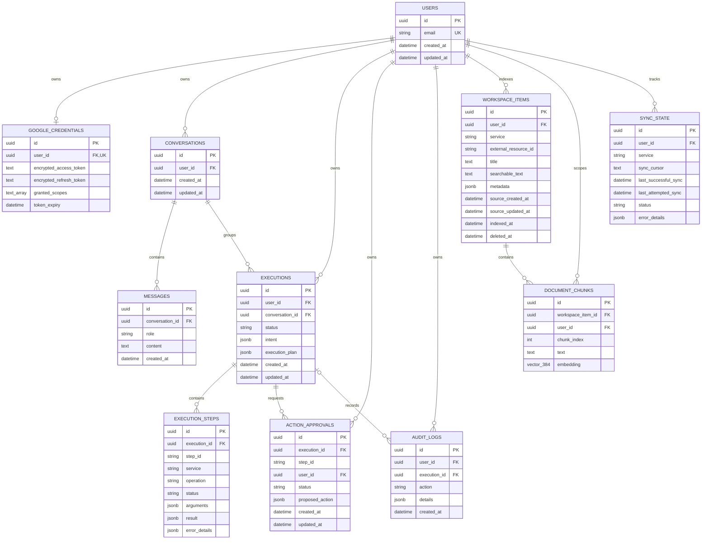

# Database ER Diagram

This diagram reflects the SQLAlchemy models currently defined in `app/db/models.py`.

## Important constraints

- `users.email` and `google_credentials.user_id` are unique.
- Workspace identities are unique on `(user_id, service, external_resource_id)`, so two users can safely index the same provider identifier without collision.
- Chunk positions are unique on `(workspace_item_id, chunk_index)`. Chunks also carry `user_id` for direct tenant filtering.
- `document_chunks.embedding` is exactly 384 dimensions and has an HNSW cosine index.
- Execution step IDs are unique within an execution: `(execution_id, step_id)`.
- One approval can exist for an execution step: `(execution_id, step_id)`.
- Sync state is unique per `(user_id, service)`.
- Most user-owned operational data cascades on user/execution deletion. Audit-log foreign keys intentionally do not declare cascade deletion.
