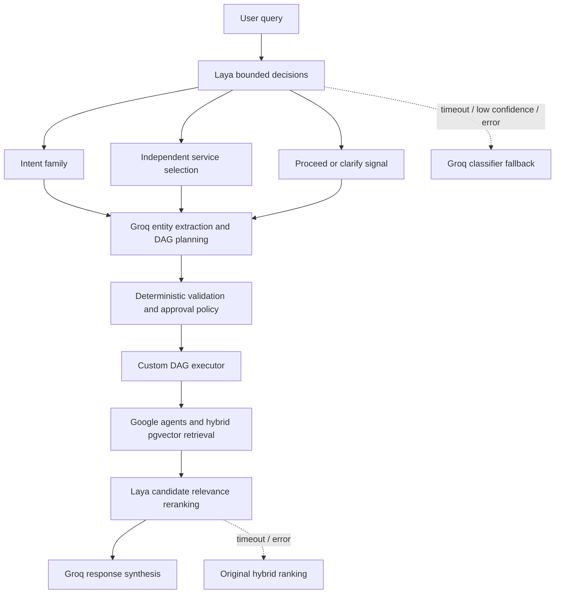

# Laya Hybrid Decision Experiment

This branch evaluates the locally hosted, open-source Laya System One model as a bounded decision layer. It does not replace the stable orchestration architecture.

## Architecture

Laya handles finite choices and calibrated yes/no judgments: intent-family routing, independent service requirements, a clarification signal, and optional relevance judgments over a bounded candidate set. Groq remains responsible for structured entity extraction, complex plan generation, and natural-language synthesis. Deterministic Python remains authoritative for schemas, operation validation, authorization, approval gates, execution, thresholds, and side effects. Laya confidence is never authorization.

## Privacy boundary

Routing sends the user request, at most three recent conversation messages, and supported service names. Reranking sends only the request plus each candidate's service, bounded title, and a maximum 500-character snippet. OAuth tokens, credentials, raw metadata, meeting passwords, full email chains, links, and attendee lists are excluded.

## Failure behavior

Missing configuration, timeouts, API errors, malformed responses, and low-confidence routing fall back to the existing Groq classifier. Reranking failures preserve the original hybrid pgvector/keyword order. The default configuration keeps Laya disabled so baseline behavior is unchanged.

## Configuration

Laya runs in its own Docker service and exposes the System One compatible HTTP API. `LAYA_MODEL=typed-decisions` selects the checkpoint tuned for bounded typed workflows. `LAYA_PRELOAD=1` keeps weights resident so warm requests avoid model-loading latency.

The relevance threshold of `0.55` is provisional. It is configuration, not a performance claim, and should be tuned only from measured evaluation results.

## Evaluation results

**Not measured yet.**

Run `python -m app.experiments.laya_benchmark` after Laya is healthy and Groq is configured. The benchmark performs classification and relevance decisions only; it does not execute Google Workspace writes.
