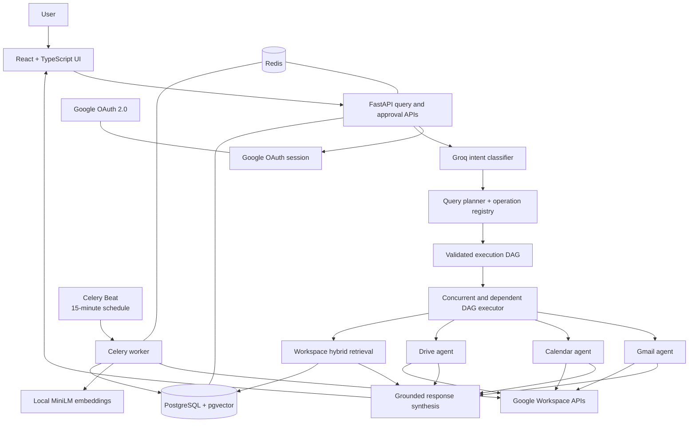

# Architecture

The implemented application converts authenticated natural-language requests into validated, observable workflows across Gmail, Google Calendar, Google Drive, and a user-scoped local semantic index.

## Request and execution flow

1. The browser authenticates through Google OAuth. The backend encrypts Google credentials and creates an HttpOnly application-session cookie; Google tokens are not exposed to frontend JavaScript.
2. The query API loads up to five recent messages from the user-owned conversation and asks Groq for a structured `Intent`.
3. The planner selects only registered operations and produces an `ExecutionPlan`. Pydantic and registry validation reject malformed steps, unsupported arguments, duplicate IDs, missing dependencies, self-dependencies, and cycles.
4. The custom executor runs dependency-ready steps together. Independent nodes execute concurrently; dependent nodes resolve explicit references such as `{"$step":"calendar_step","path":["events",0,"title"]}` from completed prior results.
5. Native agents call the Gmail, Calendar, and Drive APIs. Contextual queries may use the local workspace agent, which combines pgvector similarity, PostgreSQL text relevance, metadata filters, bounded ranking, and service filters.
6. Results are compacted before grounded synthesis. Failed and skipped steps remain distinguishable from successful empty searches.

If a dependency fails, downstream steps are skipped rather than executed with invented inputs. Missing list elements and invalid reference paths fail explicitly.

## Native APIs and the local index

Google Workspace remains the source of truth. Native agents are used for exact resource access, fresh operations, and all writes. The local index supplements those APIs for contextual and semantic retrieval; it does not replace them.

`workspace_items` stores normalized user resources and `document_chunks` stores 384-dimensional normalized vectors from `sentence-transformers/all-MiniLM-L6-v2`. Search is always constrained by `user_id`, optionally filtered by service and metadata, and bounded by `top_k`. Query embeddings are cached in process and Redis. Freshness is derived per service from `sync_state.last_successful_sync` and status. A stale or absent index can recommend, and when appropriate execute, a native read fallback; the response distinguishes recommendation from fallback actually performed.

## Synchronization

Celery Beat enqueues connected users every 900 seconds. A Celery worker retrieves bounded Gmail, Calendar, and Drive data, normalizes and chunks it, creates local embeddings, and updates per-service sync state. Redis provides the broker and a renewable per-user overlap lock. Each service records its own attempt, success, status, and safe error metadata, so one service failure does not prevent the remaining services from being attempted.

Google Docs and plain-text Drive files can contribute extracted text. PDFs are currently indexed by filename and metadata only; OCR and full PDF extraction are outside the current implementation.

## Writes and approvals

Consequential operations are never executed directly from a query. The executor stores the fully resolved proposed action and returns an `awaiting_approval` result. Authenticated approve/reject endpoints lock the user-owned approval row. Approval executes that stored action without replanning; rejection marks it skipped. A processed approval returns a conflict instead of running twice. Audit rows record approval execution or rejection.

## Persistence and isolation

PostgreSQL persists users, encrypted credentials, conversations, messages, execution plans and steps, approvals, audit records, indexed resources, chunks, and sync state. Ownership is explicit: conversations, executions, approvals, workspace resources, chunks, sync state, and retrieval queries are scoped by `user_id`. Resource uniqueness is defined within a user and service, never globally across tenants.

Redis stores application sessions, OAuth state, caches, the Celery broker/backend, and sync coordination locks. Readiness checks PostgreSQL and Redis with bounded timeouts; liveness reports only that the FastAPI process is responding.
